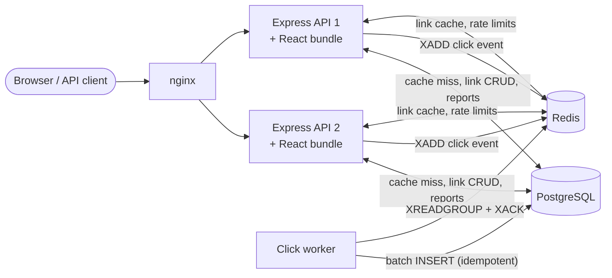

# shrt — a production-grade URL shortener

A horizontally scalable URL shortener with click analytics: a **React** single page app, an **Express** API, **PostgreSQL** and **Redis** — all in plain **JavaScript**. It is built the way a real service would be: a cache-first redirect path, asynchronous click processing, rate limiting, observability, containerised deployment and a serious automated test suite.

|                                            Dashboard                                             |                                                            Analytics                                                             |
| :----------------------------------------------------------------------------------------------: | :------------------------------------------------------------------------------------------------------------------------------: |
|  |  |

> 📖 **New to Docker, nginx or Redis?** Read the illustrated beginner's guide: [How it works](docs/HOW-IT-WORKS.md). There is also an interactive [architecture diagram](docs/architecture-flow.html) (open the file in a browser after you clone the project).

**Just want to see it running?** Install [Docker Desktop](https://www.docker.com/products/docker-desktop/) and run:

```bash
git clone https://github.com/prashant0829/shrt-url-shortner.git
cd shrt-url-shortner
docker compose up --build -d --wait    # the first run takes a few minutes: it downloads images and builds the app
```

Then open <http://localhost:8080>. Development mode, debugging and troubleshooting are in [Getting started](#getting-started).

**Contents:** [Features](#features) · [Architecture](#architecture) · [Tech stack](#tech-stack) · [Getting started](#getting-started) · [Command reference](#command-reference) · [Debugging](#debugging) · [Troubleshooting](#troubleshooting) · [API overview](#api-overview) · [Configuration](#configuration) · [Design decisions](#design-decisions-and-trade-offs) · [Testing](#testing) · [Performance](#performance) · [Scaling further](#scaling-further) · [Project layout](#project-layout) · [Working on the code](#working-on-the-code) · [Known limitations](#known-limitations)

## Features

- **Short links** — generated 7-character base62 codes or custom aliases, optional expiry, enable/disable, soft delete (a deleted code is never reused), edit destination, QR codes (PNG/SVG).
- **Accounts** — register/login with scrypt-hashed passwords and short-lived JWTs; anonymous link creation is allowed with a stricter rate limit.
- **Click analytics** — clicks over time (hourly/daily, empty buckets filled), unique visitors, countries, browsers, operating systems, devices and referrers. Bots are detected and excluded by default.
- **Fast redirects** — Redis cache-aside with negative caching and request coalescing; Postgres is only touched on a cache miss.
- **Asynchronous ingestion** — a redirect only appends an event to a Redis Stream; a separate worker batch-inserts into Postgres with idempotent writes.
- **Safe by default** — destination validation (no private/loopback/metadata addresses, no credentials in URLs, no redirect loops), per-IP/per-user rate limiting, strict security headers, no stack traces in errors, raw IPs never stored.
- **Operable** — structured JSON logs with request ids, Prometheus metrics, liveness/readiness probes, graceful shutdown, and an **OpenAPI 3.1** document generated from the same schemas that validate requests (Swagger UI at `/docs`).
- **React UI** — sign up, create links, search and manage them, and explore analytics with a chart; accessible (native dialogs, labelled controls, live regions) and XSS-safe by construction.

## Architecture



**Redirect (the hot path)** — `GET /:code`

1. Validate the code shape (junk is rejected without touching any store).
2. Look up `link:{code}` in Redis. On a miss, one Postgres query (collapsed across concurrent requests) repopulates the cache — also for _unknown_ codes, briefly, so scanning random codes never reaches the database.
3. Answer `302`, and fire-and-forget an event onto the stream. Analytics can never slow down or break a redirect.

**Click pipeline** — worker loop: read a batch → enrich (browser/OS/device/bot) → **one** `INSERT … ON CONFLICT DO NOTHING` that also bumps the link counter → `XACK`. Delivery is at-least-once; the unique event id makes the effect exactly-once.

**Layering** — a request travels through folders that match its layers: `routes/` declare the endpoint (URL, security, docs), `middleware/` handles auth, rate limits and validation, `controllers/` turn the HTTP request into a service call, `services/` hold the business rules, and `repositories/` and `cache/` are the only code that talks to PostgreSQL and Redis. Everything is a plain function: each service is a factory (`createLinkService({ links, cache, urlPolicy })`) that receives its collaborators as arguments and returns an object of functions, and all of them are wired together in one place ([`server/src/dependencies.js`](server/src/dependencies.js)), so the same code runs against in-memory fakes in unit tests and real infrastructure in integration tests.

## Tech stack

| Concern    | Choice                                                                                             |
| ---------- | -------------------------------------------------------------------------------------------------- |
| Backend    | Node.js 24, **Express 5**, JavaScript (ESM)                                                        |
| Validation | zod 4 — one schema drives validation, response contracts and the OpenAPI document                  |
| Data       | PostgreSQL 17 (plain SQL migrations, `pg`), Redis 7 (cache, rate limits, Streams) via `ioredis` 5  |
| Auth       | `node:crypto` scrypt, `jose` JWT (HS256)                                                           |
| HTTP       | helmet, cors, express-rate-limit (Redis-backed), pino-http, swagger-ui-express, Prometheus client  |
| Frontend   | **React 19** + Vite 8, plain CSS, no state library (context + small hooks)                         |
| Quality    | Vitest (server and client), Testing Library, supertest, ESLint (+ jsx-a11y, react-hooks), Prettier |
| Operations | Docker (multi-stage, non-root), Docker Compose, nginx, GitHub Actions                              |

## Getting started

There are two ways to run the project. **Docker mode** needs nothing but Docker. **Development mode** runs the Node programs on your machine (instant reload, easy debugging) and keeps only the databases in Docker.

### Prerequisites

| You need                                                                                                                                                          | Why                                                                | How to check                                                            |
| ----------------------------------------------------------------------------------------------------------------------------------------------------------------- | ------------------------------------------------------------------ | ----------------------------------------------------------------------- |
| **Docker** with Compose v2 ([Docker Desktop](https://www.docker.com/products/docker-desktop/) on Mac and Windows, Docker Engine plus the Compose plugin on Linux) | Runs PostgreSQL and Redis and, in Docker mode, the whole app       | `docker --version` · `docker compose version` · `docker info`           |
| **Node.js 22.12 or newer** (24 recommended) with npm                                                                                                              | Development mode and running the tests. Not needed for Docker mode | `node -v` · `npm -v`                                                    |
| **Free ports** 8080 (the app), 5432 (PostgreSQL), 6379 (Redis) and, in development mode, 5173 (React dev server)                                                  | The services listen on them                                        | `lsof -nP -iTCP:8080 -sTCP:LISTEN` prints nothing when the port is free |

- If `docker info` says it cannot connect to the Docker daemon, start Docker Desktop and wait until it reports that it is running.
- `nvm use` (or `fnm use`) picks Node 24 from [`.nvmrc`](.nvmrc).
- You do **not** need to install PostgreSQL, Redis, `psql` or `redis-cli`. They run inside Docker, and [Debugging](#debugging) shows how to use them from there.
- Plan for about 1–2 GB of disk (images and build cache) and roughly 750 MB of RAM while the stack is idle (measured on a Mac).

### Get the code

```bash
git clone https://github.com/prashant0829/shrt-url-shortner.git
cd shrt-url-shortner
```

Run every command in this guide from this folder (the one that contains `docker-compose.yml`).

### Option A: everything in Docker

```bash
docker compose up --build -d --wait
```

What happens, in order: Docker builds one image (it compiles the React app and installs the server's packages), starts PostgreSQL and Redis, runs the one-off **migrate** job that creates the tables, then starts two API replicas, the click **worker** and **nginx**, and waits until all of them report healthy. `--build` rebuilds what changed, `-d` gives you your terminal back, `--wait` blocks until everything is healthy. The first run takes a few minutes because it downloads base images; later runs take seconds.

Check that it works:

```bash
docker compose ps --format 'table {{.Service}}\t{{.Status}}'
curl -s localhost:8080/health/ready
```

You should see every service up and healthy (nginx has no health check, so it only says `Up`), then the readiness answer:

```text
SERVICE    STATUS
api-1      Up 2 minutes (healthy)
api-2      Up 2 minutes (healthy)
nginx      Up 2 minutes
postgres   Up 2 minutes (healthy)
redis      Up 2 minutes (healthy)
worker     Up 2 minutes (healthy)

{"status":"ok","checks":{"postgres":"up","redis":"up"}}
```

The `migrate` job is not listed because it ran once and finished (`docker compose ps -a` shows it as `Exited (0)`). Now open:

- <http://localhost:8080> for the app
- <http://localhost:8080/docs> for the interactive API documentation (Swagger UI)

> **Code changes need a rebuild in this mode.** The containers run the code that was copied into the image when it was built. After you edit files, run the same `docker compose up --build -d --wait` again.

### Option B: development mode

First-time setup (once):

```bash
npm run install:all                  # installs the dependencies of the root, server and client
cp server/.env.example server/.env   # your settings file; the defaults are fine for local work
npm run infra:up                     # starts PostgreSQL and Redis in Docker and waits until healthy
npm run migrate                      # creates the tables ("Database is up to date" = nothing left to do)
```

Then start the three programs, each in its own terminal and from the project folder:

| Terminal | Command              | What you get                                                                                        |
| -------- | -------------------- | --------------------------------------------------------------------------------------------------- |
| 1        | `npm run dev:api`    | The API on <http://localhost:8080>. It restarts by itself when you save a server file               |
| 2        | `npm run dev:worker` | The click worker. Without it, clicks are queued but never counted                                   |
| 3        | `npm run dev:web`    | The React app on <http://localhost:5173> with instant reload. It forwards `/api` calls to port 8080 |

Open <http://localhost:5173>. (The API on port 8080 only serves the web page after `npm run build`; that is how production works.) Stop a program with `Ctrl+C`. The databases keep running until you run `npm run infra:down`.

> **Run one mode at a time.** Both modes use port 8080, so stop the Docker stack (`docker compose down`) before `npm run dev:api`, otherwise it fails with `EADDRINUSE`. `docker compose down` also stops the databases, so run `npm run infra:up` again afterwards. Both modes use the same PostgreSQL and Redis containers, so your links are shared, but you are signed out when you switch because each mode signs login tokens with a different `JWT_SECRET`.

### First steps

**In the browser.** Choose **Sign up** and create an account (any email address, a password of at least 8 characters). Under **Shorten a link**, paste a long URL such as `https://example.com/some/very/long/path` and press **Shorten**. Open the short link, then open **Analytics** for that link. The click shows up after a few seconds, because the worker processes clicks in small batches.

**From the terminal.** An anonymous link needs no account:

```bash
curl -s -X POST localhost:8080/api/v1/links -H 'content-type: application/json' \
  -d '{"url":"https://example.com/some/very/long/path"}'
# => {"code":"aB3xY9k","shortUrl":"http://localhost:8080/aB3xY9k", ...}
curl -i localhost:8080/aB3xY9k          # use the "code" from your response: 302 Found, Location: https://example.com/...
```

With an account you can list your links and read their analytics. `jq` is a small tool that prints JSON nicely (`brew install jq` or `apt install jq`); without it, leave off `| jq` and copy the token from the response by hand.

```bash
# Create an account, log in, and keep the token in $TOKEN
curl -s -X POST localhost:8080/api/v1/auth/register -H 'content-type: application/json' \
  -d '{"email":"you@example.com","password":"a-long-password"}'
TOKEN=$(curl -s -X POST localhost:8080/api/v1/auth/login -H 'content-type: application/json' \
  -d '{"email":"you@example.com","password":"a-long-password"}' | jq -r .token)

# Create a link you own, with your own short name
curl -s -X POST localhost:8080/api/v1/links -H "authorization: Bearer $TOKEN" \
  -H 'content-type: application/json' -d '{"url":"https://example.com/docs","customAlias":"my-docs"}'

# List your links, then read the analytics of one of them
curl -s localhost:8080/api/v1/links -H "authorization: Bearer $TOKEN" | jq
curl -s localhost:8080/api/v1/links/my-docs/analytics -H "authorization: Bearer $TOKEN" | jq .totals
```

> **Clicks from `curl` are counted as bots.** Tools without a browser's `User-Agent` are classified as bots, and the default analytics view hides bots. Add `?includeBots=true` to the analytics URL to see them, or open the link in a browser.

Want a busy-looking chart? Queue fake clicks for a link that exists. The script runs on your machine, so run the setup steps of Option B first (`npm run install:all` and `cp server/.env.example server/.env`). A worker, in Docker or in terminal 2, then turns the clicks into analytics a few seconds later:

```bash
npm --prefix server run seed:clicks -- my-docs 500 14     # 500 clicks spread over the last 14 days
```

### Stopping and resetting

```bash
docker compose stop        # pause everything; containers and data stay (resume with: docker compose start)
docker compose down        # remove the containers; your links and users stay in Docker volumes
docker compose down -v     # remove the containers AND the volumes: deletes all links, users and clicks
```

`npm run infra:down` is the same as `docker compose down`.

> **`down -v` cannot be undone.** Use it only when you want a completely fresh start.

### Before you share it with anyone

The defaults are meant for your own machine. Set your own secrets before other people can reach the service. Docker Compose reads these values from your shell, or from a `.env` file next to `docker-compose.yml`:

```bash
JWT_SECRET="$(openssl rand -base64 48)" \
VISITOR_HASH_SECRET="$(openssl rand -base64 24)" \
BASE_URL="https://short.example.com" \
docker compose up -d --wait
```

`BASE_URL` is the public address used to build short links. HTTPS is not included: put the stack behind something that terminates TLS.

### Windows

The commands in this guide are written for macOS and Linux and have not been tested on Windows. The least surprising route is **WSL 2**: install Ubuntu through WSL, turn on Docker Desktop's WSL integration, then clone the project and run every command in the Ubuntu terminal. In PowerShell, use `copy server\.env.example server\.env` instead of `cp`, `curl.exe` instead of `curl` (in Windows PowerShell, `curl` is an alias of another command), set variables with `$env:PORT = 8090` before the command, and end continued lines with a backtick instead of `\`.

## Command reference

Run these from the project folder (the one with `docker-compose.yml`).

### npm scripts

| Command                                   | What it does                                                            |
| ----------------------------------------- | ----------------------------------------------------------------------- |
| `npm run install:all`                     | Installs the dependencies of the root, `server/` and `client/`          |
| `npm run infra:up`                        | Starts PostgreSQL and Redis in Docker and waits until they are healthy  |
| `npm run infra:down`                      | Removes every container of this project (same as `docker compose down`) |
| `npm run migrate`                         | Applies pending SQL migrations to the database named in `server/.env`   |
| `npm run dev:api`                         | The API with auto-restart on save: <http://localhost:8080>              |
| `npm run dev:worker`                      | The click worker with auto-restart on save                              |
| `npm run dev:web`                         | The React dev server with instant reload: <http://localhost:5173>       |
| `npm run build`                           | Builds the React app into `server/public`, where the API serves it from |
| `npm test`                                | Server tests (unit and integration), then client tests                  |
| `npm run lint`                            | ESLint for server and client                                            |
| `npm run format` · `npm run format:check` | Prettier: rewrite the files · only check them                           |

Scripts that live in one half of the project run with `npm --prefix server run <script>` or `npm --prefix client run <script>`:

| Script                                            | What it does                                                            |
| ------------------------------------------------- | ----------------------------------------------------------------------- |
| `server` · `start`, `start:worker`                | API · worker, without auto-restart (this is what the Docker image runs) |
| `server` · `test:unit`                            | Unit tests only. No Docker needed                                       |
| `server` · `test:integration`                     | Integration tests. They need `npm run infra:up`                         |
| `server` · `test:coverage`                        | All server tests plus a coverage report (`server/coverage/index.html`)  |
| `server` · `seed:clicks -- <code> [count] [days]` | Queues fake clicks for a link                                           |
| `server` · `loadtest`                             | Load test with autocannon (see [Performance](#performance))             |
| `client` · `test:watch`                           | Re-runs the client tests every time you save                            |
| `client` · `test:coverage`                        | Client tests plus a coverage report                                     |

### Docker Compose cheat sheet

| Task                                      | Command                                                                                                  |
| ----------------------------------------- | -------------------------------------------------------------------------------------------------------- |
| Start everything, rebuilding what changed | `docker compose up --build -d --wait`                                                                    |
| Start only the databases                  | `docker compose up -d --wait postgres redis` (or `npm run infra:up`)                                     |
| List services and their health            | `docker compose ps` (add `-a` to include finished jobs such as `migrate`)                                |
| Follow the logs                           | `docker compose logs -f api-1 api-2 worker`                                                              |
| Restart one service                       | `docker compose restart worker`                                                                          |
| Open a shell inside a container           | `docker compose exec api-1 sh`                                                                           |
| Use PostgreSQL or Redis                   | `docker compose exec postgres psql -U shortener -d urlshortener` · `docker compose exec redis redis-cli` |
| Pause everything (keeps data)             | `docker compose stop` · resume with `docker compose start`                                               |
| Remove the containers (keeps data)        | `docker compose down`                                                                                    |
| Remove the containers and **all data**    | `docker compose down -v`                                                                                 |
| Show CPU and memory use                   | `docker stats --no-stream`                                                                               |
| Show how much disk Docker uses            | `docker system df`                                                                                       |

## Debugging

The `docker compose` commands below work in both modes, because the databases always run in Docker. For logs, the difference is: in Docker mode read them with `docker compose logs`; in development mode each program prints its own logs in the terminal where you started it.

### Is it healthy?

```bash
docker compose ps                        # every service "healthy" (the expected list is in Getting started)
curl -s localhost:8080/health/live       # {"status":"ok"}: the process is up
curl -s localhost:8080/health/ready      # {"status":"ok","checks":{"postgres":"up","redis":"up"}}
```

`ready` also checks PostgreSQL and Redis and answers `503` when one of them is down. `live` stays `200`, because restarting the app would not fix a broken database.

### Read the logs

```bash
docker compose logs -f api-1 api-2 worker        # follow live (Ctrl+C stops following, not the services)
docker compose logs --tail 50 --since 10m api-1  # the last 50 lines from the past 10 minutes
docker compose logs migrate                      # what the one-off migration job did
```

In Docker mode the API writes one JSON object per line, which is easy for tools and hard for humans. Two ways to read it:

```bash
# Colourful and complete (needs `npm run install:all`, which installs pino-pretty)
docker compose logs -f --no-log-prefix api-1 | server/node_modules/.bin/pino-pretty

# One short line per request (needs jq)
docker compose logs -f --no-log-prefix api-1 | jq -R -r 'fromjson? | select(.req) | "\(.res.statusCode) \(.req.method) \(.req.url) \(.responseTime)ms"'
```

In development mode the logs are already coloured and readable. `LOG_LEVEL` in `server/.env` controls how much you see: `debug` (the default there), `trace` for more, `warn` for less.

### Follow one request

Every response has an `x-request-id` header, and every log line about that request carries the same id (`req.id`). Errors repeat it as `requestId`. nginx creates the id, or keeps the one you send, so you can choose your own:

```bash
curl -s -H 'x-request-id: debug-1' localhost:8080/api/v1/auth/me      # letters, digits, . _ - are allowed
docker compose logs api-1 api-2 | grep debug-1                        # the log line(s) of exactly that request
```

When someone reports an error, ask for the `requestId` in the error body and search the logs for it.

### Look inside PostgreSQL

```bash
docker compose exec postgres psql -U shortener -d urlshortener
```

Inside `psql`, `\dt` lists the tables (`users`, `links`, `clicks`, `schema_migrations`), `\d links` describes one, and `\q` quits. Handy one-liners that need no interactive session:

```bash
docker compose exec postgres psql -U shortener -d urlshortener -c "SELECT code, original_url, click_count, is_active FROM links ORDER BY id DESC LIMIT 5;"
docker compose exec postgres psql -U shortener -d urlshortener -c "SELECT link_id, count(*) AS clicks FROM clicks GROUP BY link_id;"
docker compose exec postgres psql -U shortener -d urlshortener -c "SELECT name FROM schema_migrations ORDER BY name;"
```

A graphical client (TablePlus, DBeaver, pgAdmin) works too: host `localhost`, port `5432`, user `shortener`, password `shortener`, database `urlshortener`.

### Look inside Redis

```bash
docker compose exec redis redis-cli                               # interactive session
docker compose exec redis redis-cli XLEN clicks                   # click events still waiting for the worker (0 = nothing waiting)
docker compose exec redis redis-cli XINFO GROUPS clicks           # the worker's group: "pending" and "lag" should be 0
docker compose exec redis redis-cli --scan --pattern 'link:*'     # links currently cached
docker compose exec redis redis-cli TTL link:my-docs              # seconds until that cache entry expires (-2 = not cached)
docker compose exec redis redis-cli --scan --pattern 'rl:*'       # rate-limit counters
```

Avoid `FLUSHALL` on a running stack: it also deletes the queue of clicks that have not been processed yet.

### Read the metrics

`/metrics` (Prometheus format) is blocked at the nginx edge, so read it from inside a container:

```bash
docker compose exec api-1 wget -qO- http://127.0.0.1:8080/metrics | grep -E '^(redirects_total|link_cache_lookups_total|clicks_enqueued_total|click_stream_length)'
```

In development mode, `curl -s localhost:8080/metrics` works directly. `link_cache_lookups_total` shows hits versus misses, `click_stream_length` is the click backlog.

### Step through the code with a debugger

Development mode makes this easy.

- **VS Code, no configuration:** open the Command Palette and run **Debug: JavaScript Debug Terminal**. Start the API in that terminal (`npm run dev:api`), click in the margin next to a line in `server/src/` to set a breakpoint, then send a request.
- **Chrome DevTools or any inspector client:**

  ```bash
  cd server
  node --inspect --env-file=.env src/server.js     # prints: Debugger listening on ws://127.0.0.1:9229/...
  ```

  Open `chrome://inspect` in Chrome and choose **Open dedicated DevTools for Node**. Use `--inspect-brk` to pause on the first line.

- **The React app:** use the browser's DevTools. The Network tab shows every `/api` call, and the Sources tab has the original files.

### Run or debug one test

```bash
npm --prefix server run test:unit -- test/unit/short-code.test.js        # one file
npm --prefix server run test:unit -- -t "private"                        # every test whose name contains "private"
npm --prefix server run test:integration -- test/integration/api-redirect.test.js   # needs npm run infra:up
npm --prefix client test -- src/hooks/useAsync.test.jsx                  # one client file
npm --prefix client run test:watch                                       # re-run client tests on every save
```

To pause inside a test, start it with the inspector and attach from VS Code (**Debug: Attach to Node Process**) or `chrome://inspect`:

```bash
cd server && npx vitest run --project unit --inspect-brk --no-file-parallelism test/unit/short-code.test.js
```

The integration tests use their own database (`urlshortener_test`) and Redis database 15, so they never touch your real links.

## Troubleshooting

| What you see                                                                                                    | Why                                                                                                                                                                          | What to do                                                                                                                                                                                                                                   |
| --------------------------------------------------------------------------------------------------------------- | ---------------------------------------------------------------------------------------------------------------------------------------------------------------------------- | -------------------------------------------------------------------------------------------------------------------------------------------------------------------------------------------------------------------------------------------- |
| `Cannot connect to the Docker daemon` (or `docker: command not found`)                                          | Docker is not running, or not installed                                                                                                                                      | Start Docker Desktop (on a Mac: `open -a Docker`), wait until it says it is running, then try again                                                                                                                                          |
| `no configuration file provided: not found`                                                                     | You are not in the project folder                                                                                                                                            | `cd` into the folder that contains `docker-compose.yml`                                                                                                                                                                                      |
| `listen EADDRINUSE: address already in use 0.0.0.0:8080` when the API starts                                    | Another program uses port 8080, usually the Docker stack (nginx)                                                                                                             | `docker compose down`, then `npm run infra:up`. To find the culprit: `lsof -nP -iTCP:8080 -sTCP:LISTEN`. To keep both running: `PORT=8090 BASE_URL=http://localhost:8090 npm run dev:api` (the React dev server still forwards to port 8080) |
| `Bind for 0.0.0.0:5432 failed: port is already allocated` (also 6379 or 8080)                                   | A local PostgreSQL or Redis, or another container, already owns that port                                                                                                    | Stop that program, or change the left-hand number in the `ports:` line of `docker-compose.yml` (for example `'5433:5432'`) and, in development mode, the port in `DATABASE_URL` or `REDIS_URL` in `server/.env`                              |
| `Invalid environment configuration: - DATABASE_URL: ...`                                                        | The server refuses to start without its settings, and `server/.env` is missing                                                                                               | `cp server/.env.example server/.env`, then start the program again                                                                                                                                                                           |
| `ECONNREFUSED` on port 5432 or 6379                                                                             | PostgreSQL or Redis is not running                                                                                                                                           | `npm run infra:up`, then check `docker compose ps`                                                                                                                                                                                           |
| `Cannot reach Postgres for integration tests`                                                                   | The integration tests need the databases                                                                                                                                     | `npm run infra:up`, then run the tests again                                                                                                                                                                                                 |
| <http://localhost:8080> shows `{"error":{"code":"ROUTE_NOT_FOUND", ...}}` instead of the app (development mode) | The React app has not been built, so the API can only answer with JSON (it logs `UI build not found`)                                                                        | `npm run build`, or use the dev server at <http://localhost:5173>                                                                                                                                                                            |
| The React dev server (port 5173) shows errors or no data                                                        | The API is not running on port 8080                                                                                                                                          | Start it with `npm run dev:api`                                                                                                                                                                                                              |
| Links work, but clicks and analytics stay at 0                                                                  | The worker is not running, **or** you clicked with `curl` (counted as a bot, hidden by default), **or** it has not been processed yet (the worker handles clicks in batches) | Start the worker (`npm run dev:worker`, or check `docker compose ps worker`). Add `?includeBots=true` to the analytics URL. Look at the waiting events: `docker compose exec redis redis-cli XLEN clicks`. Give it a few seconds             |
| `429 Too Many Requests`, error code `RATE_LIMITED`                                                              | A per-IP rate limit was hit (for example 10 logins per minute)                                                                                                               | Wait the number of seconds in the `Retry-After` header. For experiments in development mode, set `RATE_LIMIT_ENABLED=false` in `server/.env` and restart the API                                                                             |
| You changed the code but Docker still behaves the old way                                                       | The containers run the code copied into the image when it was built                                                                                                          | `docker compose up --build -d --wait`. (Development mode restarts by itself.)                                                                                                                                                                |
| You are signed out after switching between Docker mode and development mode                                     | Each mode signs login tokens with a different `JWT_SECRET`                                                                                                                   | Sign in again. Your links are shared; only the session differs                                                                                                                                                                               |
| Short links show the wrong host or port                                                                         | `BASE_URL` does not match the address you use                                                                                                                                | Set `BASE_URL` in `server/.env`, or for Docker: `BASE_URL=http://localhost:9090 docker compose up -d`                                                                                                                                        |
| `docker compose up` stops with `dependency failed to start` or `unhealthy`                                      | One service failed its health check                                                                                                                                          | `docker compose ps -a`, then `docker compose logs <service>` and read the last lines                                                                                                                                                         |
| The build fails with `no space left on device`                                                                  | Docker's disk is full of old images and build cache                                                                                                                          | `docker system df` shows what uses the space. `docker builder prune` clears the build cache                                                                                                                                                  |
| You want a completely fresh start                                                                               | -                                                                                                                                                                            | `docker compose down -v` deletes **all** data, then start again                                                                                                                                                                              |

Still stuck? Read the logs of the service that misbehaves ([Read the logs](#read-the-logs)) and look for the first error, not the last one.

## API overview

Full, interactive reference (generated from the code) at **`/docs`**.

| Method & path                          | Auth     | Purpose                                                                      |
| -------------------------------------- | -------- | ---------------------------------------------------------------------------- |
| `POST /api/v1/auth/register`           | –        | Create an account, returns a token                                           |
| `POST /api/v1/auth/login`              | –        | Exchange credentials for a token                                             |
| `GET /api/v1/auth/me`                  | required | Current account                                                              |
| `POST /api/v1/links`                   | optional | Create a link (`url`, `customAlias?`, `expiresAt?`)                          |
| `GET /api/v1/links`                    | required | List your links: newest first, keyset pagination (`cursor`), search (`q`)    |
| `GET/PATCH/DELETE /api/v1/links/:code` | required | Read, edit (destination / expiry / enabled), delete                          |
| `GET /api/v1/links/:code/analytics`    | required | Time series + breakdowns (`from`, `to`, `interval=hour\|day`, `includeBots`) |
| `GET /api/v1/links/:code/qr`           | –        | QR code (`format=png\|svg`, `size`)                                          |
| `GET /:code`                           | –        | The redirect: `302`, `404` unknown, `410` expired/disabled/deleted           |
| `GET /health/live` · `/health/ready`   | –        | Liveness · readiness (checks Postgres and Redis)                             |
| `GET /metrics`                         | –        | Prometheus metrics (blocked at the nginx edge)                               |

Errors always look like `{"error": {"code": "ALIAS_TAKEN", "message": "..."}, "requestId": "..."}`.

## Configuration

All configuration is environment variables, validated at startup (the process refuses to boot on a bad value). See [`server/.env.example`](server/.env.example) for the full annotated list. In development mode set them in `server/.env`; the Docker stack gets them from the `environment:` block of `docker-compose.yml`, and `BASE_URL`, `JWT_SECRET` and `VISITOR_HASH_SECRET` can be overridden from your shell (see [Before you share it with anyone](#before-you-share-it-with-anyone)).

| Variable                               | Default                 | Meaning                                                                              |
| -------------------------------------- | ----------------------- | ------------------------------------------------------------------------------------ |
| `DATABASE_URL`, `REDIS_URL`            | required                | Data stores                                                                          |
| `JWT_SECRET` / `VISITOR_HASH_SECRET`   | required (≥ 32 / ≥ 16)  | Token signing key / key for hashing visitor IPs                                      |
| `BASE_URL`                             | `http://localhost:8080` | Public origin used to build short URLs                                               |
| `TRUST_PROXY_HOPS`                     | `0`                     | Reverse proxies in front of the app. Set it to the **real** number (see below)       |
| `WEB_DIR`                              | `server/public`         | Directory with the built React app                                                   |
| `BLOCKED_DOMAINS`                      | empty                   | Comma-separated domains that cannot be shortened                                     |
| `LINK_CACHE_TTL_SECONDS`               | `3600`                  | Cache lifetime of a link (+ up to 10% jitter)                                        |
| `RATE_LIMIT_*_PER_MINUTE`              | 300 / 20 / 120 / 10     | Default API / anonymous create / signed-in create / auth (register + login combined) |
| `WORKER_BATCH_SIZE`, `WORKER_BLOCK_MS` | `500`, `2000`           | Worker batching                                                                      |
| `GEO_COUNTRY_HEADER`                   | `cf-ipcountry`          | Header carrying the visitor's country (set by your CDN)                              |

## Design decisions and trade-offs

These are the choices worth discussing; each is small, deliberate and covered by tests.

### Backend

- **`302`, not `301`.** Browsers cache permanent redirects and would never call the service again, silently breaking click counts, edits, expiry and takedowns. The cost is one request per click, which the cache makes cheap.
- **Random base62 codes with a database uniqueness check** instead of a counter or hash. 62⁷ ≈ 3.5 trillion codes, generated from a CSPRNG with rejection sampling (no modulo bias), need no coordination between replicas and are unguessable; a collision is just a retry (odds per attempt are links ÷ 62⁷: about 1 in 3.5 million at a million links, 1 in 3,500 at a billion — and five attempts all failing at a billion links is ~10⁻¹⁸). The unique index is the source of truth; the code length can be raised long before the table nears 10¹⁰ rows.
- **Cache-aside with three protections.** _Negative caching_ (unknown codes cached for 60 s) blunts enumeration; _single-flight_ collapses N concurrent misses for one code into one query; _TTL jitter_ stops a burst of links expiring together. Expiry is evaluated per request against the cached row, so a TTL can never extend a link's life. Edits and deletes invalidate the key, and a failed invalidation surfaces as an error instead of serving stale data.
- **Graceful degradation.** Redis is treated as an optimisation: if it is down, redirects fall back to Postgres, click events are dropped and counted, and the rate limiter fails open. If Postgres is down, cached links keep redirecting. Readiness reports `503`, liveness stays `200` (a restart would not help). All of this is tested against a dead Redis.
- **Reliable, idempotent click ingestion.** At-least-once delivery from Redis Streams plus a unique `event_id` gives an exactly-once _effect_. A worker that fails retries its own unacknowledged batch immediately; entries abandoned by a crashed worker are reclaimed via `XAUTOCLAIM`; malformed events are acknowledged and dropped so they cannot block the queue; events for deleted links are ignored rather than failing the batch. The stream is length-capped so a dead worker cannot exhaust Redis memory, and the backlog is exported as a metric. Each worker keeps a heartbeat file that the container health check reads.
- **Analytics SQL that scales with the range, not the table.** One index range scan aggregates the buckets; `generate_series` + `LEFT JOIN` fills empty ones; all five breakdowns come from a single filtered pass. Requests are bounded (≤ 1,000 buckets). The per-link counter is denormalised for the list view and counts humans only, matching the default analytics view.
- **Destination policy.** Only `http(s)`; no embedded credentials; blocks loopback, private, link-local (cloud metadata), CGNAT and multicast ranges in every IPv4/IPv6 spelling (`2130706433`, `0x7f.1`, `[::ffff:127.0.0.1]`, …); blocks single-label hosts and `.local`/`.internal`; blocks the service's own host and a configurable domain blocklist.
- **Privacy.** Visitors are counted with a keyed hash of IP + user agent; the IP is never stored or queued. Only the referrer _host_ is kept.
- **Auth details.** scrypt (OWASP parameters, self-describing hash format so cost can be raised later), constant-time comparison, a dummy hash for unknown emails so response time does not reveal which accounts exist, bearer tokens (no cookies, so no CSRF), 1 h lifetime.
- **Soft delete.** A deleted code stays reserved, so an old printed QR code can never be re-pointed by someone else.

### Express specifics

- **Routes declare themselves.** Each route is one object — security, rate limit, input schemas, responses, docs and the controller function that handles it — and [`router-factory.js`](server/src/routes/router-factory.js) turns it into the middleware chain _and_ an entry in the OpenAPI document. Validation, behaviour and documentation cannot drift apart, and a test validates the generated document with a real OpenAPI parser.
- **Middleware order is a security feature.** `identify caller → rate limit → reject bad token → require login → parse body → validate → handler`. Rejecting a bad token _after_ the limiter means unauthenticated and bad-token requests are throttled too (a real hole the test suite caught). Rate limiting sits before body parsing, so floods are cut off before any work is done. Express runs middleware in registration order, so the catch-all `/:code` redirect is mounted last.
- **Proxy trust is a hop count, not a boolean.** `TRUST_PROXY_HOPS=1` makes Express read the client IP from the _right-most_ `X-Forwarded-For` entry — the one the nearest proxy added — so a client cannot spoof its address, even if a proxy appends instead of overwriting. nginx additionally overwrites the header. Verified against the running stack.
- **A self-healing Redis store for the rate limiter.** The off-the-shelf Redis store loads its Lua script at start-up; if Redis is briefly down then, rate limiting stays off until the next restart. A ~40-line store built on ioredis's `defineCommand` sends the script lazily and re-sends it if Redis forgets it (tested with `SCRIPT FLUSH`).
- **The UI is registered file by file.** A static mount on `/` would `stat()` the disk on every short-link click just to learn that `public/<code>` does not exist; instead the bundle's files are routed explicitly at start-up. Fingerprinted assets are cached for a year, `index.html` is always revalidated.
- **Draining on shutdown.** On `SIGTERM` the server answers in-flight requests with `Connection: close`, stops accepting new ones, then closes the pool and Redis — exits in under a second, code 0.
- **Express 5 conveniences used deliberately:** async handlers that throw reach the error middleware without wrappers; parsed input lives on `req.input` because `req.query` is read-only.

### Frontend

- **Plain React, small surface.** Context for auth, links and toasts; a few hooks; no state library and no router — short codes live at the URL root, so client-side routes would collide with them.
- **No stale responses.** `useAsync` stores each result with the key it belongs to and aborts the previous request (`AbortController`), so a slow answer can never overwrite a newer one; "loading" is derived, not set inside effects.
- **Native `<dialog>` for modals** — focus trapping, Escape-to-close and the backdrop for free. `eslint-plugin-jsx-a11y` runs in CI; toasts use a live region.
- **XSS-safe by construction.** React escapes text; `react/no-danger` is an error, a test scans the sources for `innerHTML`/`eval`, and a component test renders a hostile destination URL and checks it stays text.
- **Session handling.** The token lives in `localStorage` (simple, survives reloads; the strict Content-Security-Policy is the mitigation for XSS). An invalid or expired token signs the user out with an explanation.

### Plain JavaScript, on purpose

Without a compiler, correctness comes from other layers: zod validates every boundary (env, request bodies, stream events); closures keep each module's internals private (there are no classes, and a lint rule keeps it that way); and the contract tests parse real API responses with the same strict schemas that generate the docs, so a leaked or missing field fails a test.

## Testing

```bash
npm run infra:up          # the server's integration tests need Postgres + Redis
npm test                  # server (345 tests, ~19 s) + client (72 tests, ~4 s)
npm --prefix server run test:unit          # no infrastructure needed
npm --prefix server run test:coverage      # ≈ 93% statements / branches
npm --prefix client run test:coverage      # ≈ 95% statements
npm run lint && npm run format:check
```

Running or debugging a single test is covered in [Run or debug one test](#run-or-debug-one-test).

- **Server unit tests** (in-memory fakes): code generation, URL policy, password hashing, JWTs (tampering, `alg=none`, expiry), config validation, link service, redirect resolver (caching, single-flight, expiry), analytics rules, click enrichment, request validation and OpenAPI generation.
- **Server integration tests** (real Postgres and Redis, isolated test databases): repositories and the analytics SQL, the full click pipeline including crash/redelivery/reclaim/poison-message scenarios, the Redis rate-limit store, and every HTTP endpoint end to end — auth, ownership, pagination, caching, invalidation, rate limits, security headers, OpenAPI validity, metrics, response contracts, and the app running with Redis unavailable.
- **Client tests** (Vitest + Testing Library): the API client, hooks (including out-of-order responses), the chart, and full user flows against a fake API — sign up/in/out, session restore and expiry, creating links, search, paging, enable/disable/delete with confirmation, analytics ranges, XSS safety.
- **Mutation spot-check.** I deliberately broke critical behaviours one at a time (ownership check, idempotent insert, negative caching, private-address blocking, token rejection, cache invalidation, limiter ordering, request validation, proxy trust, error-message leaking, and more: 17 in the latest round); the suite failed for each.
- **Also verified against the Docker stack:** load balancing across replicas, failover when a replica stops, graceful shutdown (exit code 0 in under a second), `X-Forwarded-For` spoofing, `/metrics` blocked at the edge, and the UI and Swagger page in a real browser (no console errors).
- CI ([`.github/workflows/ci.yml`](.github/workflows/ci.yml)) runs server lint + tests with Postgres/Redis service containers, client lint + tests + build, formatting, and a Docker image build.

## Performance

Measured on a MacBook Air (Apple silicon) with [`npm --prefix server run loadtest`](server/scripts/loadtest.mjs) (autocannon, 100 connections, 10 s). The load generator, Node, and — for the last row — Docker's Linux VM all share the same laptop, so treat these as indicative, not as capacity numbers.

| Scenario                                         | Requests/sec | p50   | p99   |
| ------------------------------------------------ | -----------: | ----- | ----- |
| Redirect, one Node process, JSON request logs on |      ~17,300 | 5 ms  | 11 ms |
| Redirect, one Node process, `LOG_LEVEL=warn`     |      ~18,600 | 4 ms  | 11 ms |
| Create link (insert + cache write), one process  |       ~7,600 | 12 ms | 23 ms |
| Redirect, full Docker stack (nginx + 2 replicas) |      ~11,200 | 8 ms  | 43 ms |

The redirect path is served entirely from Redis; during the full-stack run the worker stored every one of the ~123,000 click events with no backlog. The Docker figure is lower mainly because Docker Desktop on macOS routes all traffic through a VM. These numbers were measured before the code was reorganised into layers and plain factory functions; the logic is the same, but they have not been measured again, so run the load test yourself for figures from your machine.

## Scaling further

| Bottleneck                       | Next step                                                                                                                                                                             |
| -------------------------------- | ------------------------------------------------------------------------------------------------------------------------------------------------------------------------------------- |
| API throughput                   | Add replicas (stateless). Connection pools are per process (`DB_POOL_MAX`): size them against Postgres `max_connections`, or add PgBouncer                                            |
| Redirect latency worldwide       | Put a CDN/edge in front and cache the `302` for a few seconds — trading exact click counts and instant takedown for latency                                                           |
| Postgres reads / writes          | Read replica for analytics queries; partition `clicks` by month (drop old partitions instead of deleting rows)                                                                        |
| Analytics cost on very hot links | Roll clicks up into hourly/daily aggregate tables, written by the worker                                                                                                              |
| Redis memory / single node       | Redis Cluster or Sentinel; the stream key is the only one that must not be evicted (`volatile-lru` protects it)                                                                       |
| Event volume                     | Add workers to the same consumer group (already supported), or swap the Redis click publisher ([`redis-click-publisher.js`](server/src/queue/redis-click-publisher.js)) for Kafka/SQS |

## Project layout

```
server/                          Express API and click worker
  src/
    server.js · worker.js        Process entry points (API, click worker)
    app.js · dependencies.js     Express assembly · where every object is created and wired
    constants.js · errors.js     Enums and fixed values · error helpers
    routes/                      One file per endpoint group: URL, security, validation, OpenAPI docs
    controllers/                 HTTP handlers: read the request, call a service, send the response
    middleware/                  Auth, rate limits, validation, security headers, request id, errors, UI
    schemas/                     zod schemas for requests, responses and click events
    services/                    Business rules: links, auth, analytics, redirect lookup, click tracking
    repositories/                SQL only: links, users, clicks
    cache/                       Redis link cache (cache-aside)
    queue/                       Click events: Redis Stream publisher and the worker's consumer
    infra/                       Postgres pool, Redis clients, logger, metrics, migrations, shutdown
    utils/                       Small pure helpers: short codes, pagination, QR, dates, click enrichment
    config/                      Environment validation
  migrations/                    Plain SQL, applied in order inside transactions
  scripts/                       loadtest.mjs · seed-clicks.js
  test/                          unit/ · integration/ · helpers/
client/                          React single page app (Vite)
  src/
    constants.js                 Enums, API paths, limits and timings
    api/                         Fetch wrapper (no React dependency)
    context/ · hooks/            Auth, links and toast state · data-loading hooks
    components/                  Dialogs, forms, list, analytics chart
    test/                        Fake API and render helpers
docs/                            HOW-IT-WORKS.md (beginner's guide) · architecture-flow.html · screenshots/
nginx/ · Dockerfile · docker-compose.yml · .github/workflows/ci.yml
.nvmrc                           Node version for nvm and fnm
```

## Working on the code

### Where things go

A request travels through the folders in this order, and each layer only talks to the next one:

```text
routes/        declare the endpoint: URL, security, validation, docs
middleware/    auth, rate limits, validation
controllers/   read the request, call a service, send the response
services/      business rules (no HTTP in here)
repositories/  all SQL            cache/  Redis link cache
```

The rules we follow:

- **Plain functions, no classes.** A service or controller is a factory such as `createLinkService({ links, cache, urlPolicy })` that receives what it needs as arguments and returns an object of functions. ESLint reports a `class` as an error.
- **Fixed values live in one place:** [`server/src/constants.js`](server/src/constants.js) and [`client/src/constants.js`](client/src/constants.js). No magic strings or numbers in the code.
- **Everything is created and wired in one file:** [`server/src/dependencies.js`](server/src/dependencies.js). That is what lets tests swap in in-memory fakes.
- **Comments explain why, not what.** Good names do the explaining.
- Prettier formats and ESLint checks: `npm run format` and `npm run lint`.

### Adding an endpoint, step by step

1. **Schemas.** Describe the request and the response with zod in `schemas/<area>.schemas.js`. They validate input and generate the API docs.
2. **Repository.** Add the SQL in `repositories/<area>.repository.js` if you need new data access.
3. **Service.** Put the business rule in `services/<area>.service.js`. It must not know about HTTP.
4. **Controller.** Add a function in `controllers/<area>.controller.js` that reads the validated input from `req.input`, calls the service and sends the response.
5. **Route.** Declare it in `routes/<area>.routes.js` with `route({ method, path, security, request, responses, handler, ... })`. Auth, rate limiting, validation and the OpenAPI entry all come from that one declaration. Check the result at <http://localhost:8080/docs>.
6. **Wiring.** Only if you created a new service or controller: create it in `dependencies.js`.
7. **Tests.** A unit test with the in-memory fakes from `test/helpers/fakes.js` (see `test/unit/link-service.test.js`) and an integration test that calls `ctx.app.inject(...)` (see `test/integration/api-links.test.js`).

Before you commit: `npm run lint && npm run format:check && npm test`.

## Known limitations

- Access tokens cannot be revoked before they expire (1 h); there is no refresh-token flow.
- Country comes from a CDN header (`GEO_COUNTRY_HEADER`) rather than an IP database, so it is "Unknown" without a CDN in front.
- Expired and deleted links remain in the database (by design, to keep codes reserved); there is no purge job for old clicks.
- The Prometheus endpoint is unauthenticated and relies on the network edge to keep it private.
- The client uses ESLint 9 because the React lint plugins do not support ESLint 10 yet.
