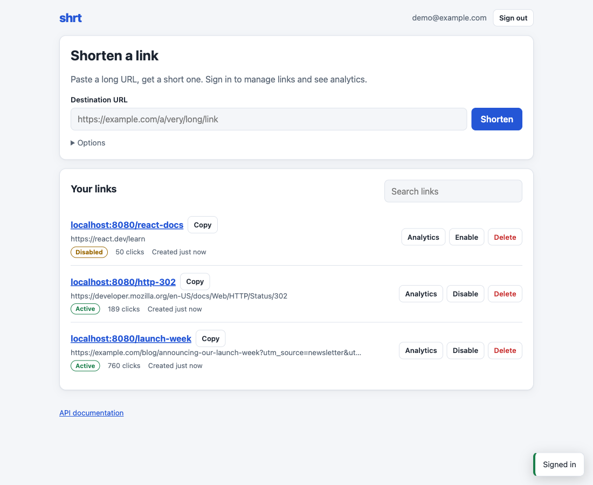
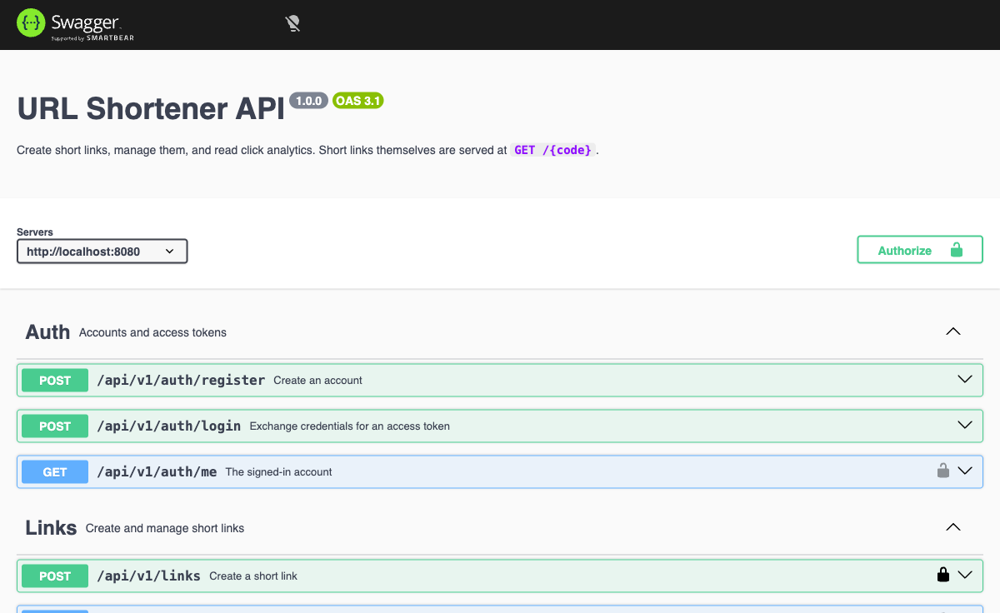
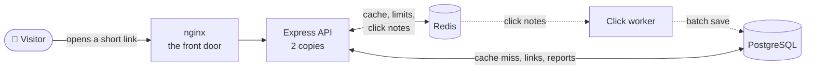
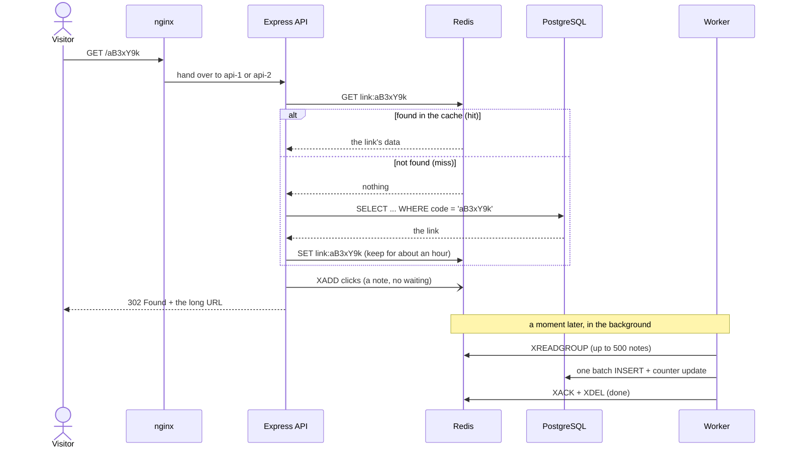
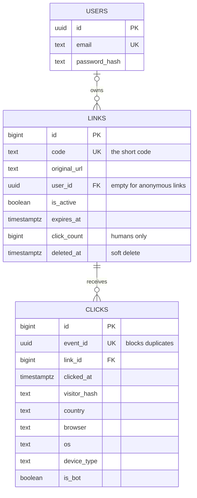
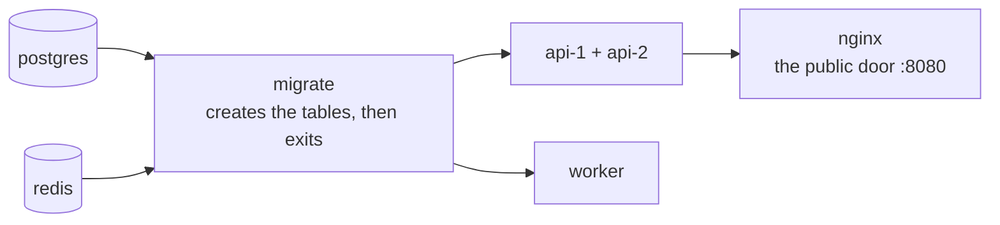

<div align="center">

# 🔗 shrt — how it works

**An illustrated, beginner-friendly tour of a production-style URL shortener**

What it does · how one click travels through the system · Docker, nginx and Redis explained · how to run it

<br />


</div>

> **Never used Docker, nginx or Redis?** This guide is for you. Every idea is explained in plain words with a small example, and jargon is explained in [square brackets]. For the API reference, the configuration table and the design trade-offs, see the main [README](../README.md).

## Contents

- 💡 [The idea in 30 seconds](#the-idea-in-30-seconds)
- 🧭 [The big picture](#the-big-picture)
- 👆 [Life of a click](#life-of-a-click)
- 🔗 [Creating a short link](#creating-a-short-link)
- 🐘 [The database](#the-database)
- 🐳 [Docker from zero](#docker-from-zero)
- 🚪 [nginx, the front door](#nginx-the-front-door)
- ⚡ [Redis, the fast notepad](#redis-the-fast-notepad)
- 🧯 [When things break](#when-things-break)
- 🚀 [Run it](#run-it)
- 🧪 [Try it yourself](#try-it-yourself)
- 🔧 [Troubleshooting](#troubleshooting)
- 🎤 [Explain it in 30 seconds](#explain-it-in-30-seconds)
- 📚 [Where to read the code](#where-to-read-the-code)
- 📖 [Glossary](#glossary)

## The idea in 30 seconds

You paste a long link and get back a short one, like `http://localhost:8080/aB3xY9k`. Anyone who opens the short link lands on the long page, and the app quietly records the click (country, browser, device) so you can see charts on a dashboard.

Picture a **restaurant**. Every piece of the project is a person or a thing in it:

|     | Piece                      | In the restaurant                            | Its job here                                                                    |
| :-: | -------------------------- | -------------------------------------------- | ------------------------------------------------------------------------------- |
| 💻  | **React app**              | the menu and ordering screen                 | the web page you click around in                                                |
| 🚪  | **nginx**                  | the host at the door                         | receives every visitor and sends them to a free waiter                          |
| 🍴  | **Express API** (2 copies) | two waiters                                  | Node.js programs [JavaScript running outside the browser] that do the real work |
| 📝  | **Redis**                  | the notepad on the counter                   | very fast memory for things that are asked again and again                      |
| 🐘  | **PostgreSQL**             | the filing cabinet in the back               | permanent storage for users, links and clicks                                   |
| 🎫  | **Redis Stream**           | the order-ticket rail                        | a waiting line of "a click happened" notes                                      |
| 🥣  | **Worker**                 | the kitchen helper                           | files those notes into the cabinet a little later                               |
| 🐳  | **Docker Compose**         | a lunchbox for each person, plus a checklist | every piece is packed with everything it needs, and one command opens them all  |

|                                          Dashboard                                          |                                                          Analytics                                                          |
| :-----------------------------------------------------------------------------------------: | :-------------------------------------------------------------------------------------------------------------------------: |
|  |  |

The API also documents itself. Open `/docs` to get an interactive page where you can try every endpoint:

<p align="center">
  
</p>

## The big picture

Here is every moving part and who talks to whom. Solid arrows happen while the visitor waits. Dotted arrows are background work.



| Piece           | Runs as                                        | Port                                       | Made with                 |
| --------------- | ---------------------------------------------- | ------------------------------------------ | ------------------------- |
| **nginx**       | container `nginx`                              | `8080` on your machine (goes to 80 inside) | nginx 1.27                |
| **Express API** | containers `api-1` and `api-2`                 | `8080` inside Docker (not opened outside)  | Node.js 24 + Express 5    |
| **React app**   | static files served by the API, no container   | `5173` in dev mode (Vite)                  | React 19 + Vite 8         |
| **Worker**      | container `worker`                             | none, it has no web server                 | the same image as the API |
| **PostgreSQL**  | container `postgres`                           | `5432`                                     | PostgreSQL 17             |
| **Redis**       | container `redis`                              | `6379`                                     | Redis 7                   |
| **migrate**     | a one-shot container that exits when it's done | none                                       | the same image as the API |

> [!TIP]
> Prefer a clickable picture? Download [`architecture-flow.html`](architecture-flow.html) and open it in a browser. GitHub shows HTML files as source code, so it has to be opened locally.

## Life of a click

What happens between "someone taps a short link" and "they see the long page"?



In words:

1. The browser asks `GET /aB3xY9k` and arrives at **nginx**.
2. nginx hands the request to **api-1 or api-2**, whichever is less busy.
3. The API asks **Redis**: "do you know `link:aB3xY9k`?" A junk code like `/a` is refused right here, before anything is touched.
4. On a **miss** [not found in Redis], the API asks **PostgreSQL** (`SELECT … WHERE code = …`). That is quick because `code` has an index [a sorted lookup table, like the index at the back of a book]. The answer is saved in Redis for about an hour. Unknown codes are saved as "doesn't exist" for 60 seconds, so someone guessing random codes cannot hammer the database (_negative caching_).
5. The API answers **`302 Found`** with the long URL, and the browser follows it.
6. At the same moment, the API drops a "click happened" note onto the **Redis Stream** and does **not** wait for it (_fire-and-forget_). Analytics can never slow down or break a redirect.
7. The **worker**, a separate program, takes notes in batches of up to 500. It works out the browser, OS and device from the User-Agent [a header where the browser says what it is, like "Chrome on Mac"], and whether the visitor is a bot.
8. The worker saves the whole batch to **PostgreSQL in a single SQL statement**, adds to the link's counter, and tells Redis "done".

> [!NOTE]
> **Why 302 and not 301?** 301 means "permanent", so browsers remember it and never ask us again. That would silently break click counts, edits and expiry. 302 means "temporary", so every click comes back to us.

> [!NOTE]
> **Why the detour in steps 6 to 8?** Saving every click to the database inside the redirect would make each redirect slower, and a database hiccup would break redirects. A queue means "redirect now, record later".

> [!TIP]
> **What if the worker dies halfway?** Notes it never confirmed stay "pending" and are handed out again: straight back to the same worker, or to another one after 60 seconds. Can a click be counted twice? No. Every note carries a unique `event_id`, and the `clicks` table refuses duplicates (`ON CONFLICT DO NOTHING`). **Delivered at least once + unique id = counted exactly once.**

## Creating a short link

`POST /api/v1/links` goes through these steps:

1. **Rate limit check.** Too many requests in a minute get a polite "slow down" (more in [Redis](#redis-the-fast-notepad)).
2. **URL rules.** Only `http(s)`, no passwords inside the URL, and no `localhost` or private addresses. Without this, the service could be tricked into pointing at things inside someone's network.
3. **Make a code.** Seven random characters, explained below.
4. **Save it in PostgreSQL.** A unique index refuses duplicates.
5. **Also put it in Redis**, so the very first click is already fast.

A custom alias such as `/my-sale` follows the same path, but you get `ALIAS_TAKEN` if someone already has it. Words like `api`, `docs` and `admin` are reserved because they are real pages.

<details>
<summary><b>Deep dive: how the 7-character code is made</b></summary>

<br />

**The space of codes.** The alphabet is `0-9`, `A-Z` and `a-z`, which is **62** characters. Seven slots give 62⁷ = **3,521,614,606,208** (about 3.5 trillion) possible codes.

**The generator** ([`link-code.js`](../server/src/modules/links/link-code.js), trimmed):

```js
export function generateCode(length = 7) {
  let code = '';
  while (code.length < length) {
    for (const byte of randomBytes((length - code.length) * 2)) {
      // 248 = 4 * 62: discarding larger bytes removes modulo bias
      if (byte < 248 && code.length < length) code += ALPHABET.charAt(byte % 62);
    }
  }
  return code;
}
```

**Worked example.** The computer's secure random generator hands out bytes from 0 to 255.

- Byte `200` → `200 % 62 = 14` → the 15th character of the alphabet → `E`.
- Byte `250` is 248 or more, so it is **thrown away** and a new byte is drawn.

**Why throw bytes away?** 256 is not a multiple of 62 (256 = 4 × 62 + 8). If every byte were used, the first 8 characters would come up 5 times out of 256 instead of 4, which makes them 25 % more likely than the rest [this is called _modulo bias_]. Dropping bytes 248 to 255 leaves exactly 248 = 4 × 62 values, so each of the 62 characters is equally likely (_rejection sampling_).

**Collisions.** Two links could draw the same code. The chance that a new code is already taken is roughly `links stored ÷ 3.5 trillion`:

| Links stored | Chance a fresh code is already taken |
| ------------ | ------------------------------------ |
| 1 million    | about 3 in 10 million (0.00003 %)    |
| 1 billion    | about 3 in 10 thousand (0.03 %)      |

The database has a **unique index** on `code`. If an insert hits a duplicate, the service simply draws a new code, up to 5 times. Five collisions in a row, even at a billion links, is around 1 chance in 10¹⁸.

**Why random and not a counter** (1, 2, 3… turned into base62)? A counter is guessable, so anyone could walk through everybody's links. It would also need one number that every API copy agrees on. Random codes need no agreement at all.

</details>

## The database

PostgreSQL is the **source of truth**: if Redis is wiped, nothing is lost. There are three tables.



- **`users`** holds the email and a `password_hash`. scrypt is a deliberately slow one-way scramble [a _hash_], so the real password is never stored.
- **`links`** has a unique index on `code`, which is what makes the redirect lookup fast. "Delete" only sets `deleted_at` (_soft delete_), so an old printed QR code can never be re-pointed by someone who grabs the same code.
- **`clicks`** has one row per click. An index on `(link_id, clicked_at)` makes "clicks of link X in this date range" fast, and that is exactly what the charts ask for.
- **Migrations** are numbered SQL files (`001_users.sql`, `002_links.sql`, …) applied once, in order [like git history for the shape of the database]. The `migrate` container runs them before the API starts.
- **Privacy:** the visitor's IP address is never stored. `visitor_hash` is a secret-keyed hash of IP + browser, so the app can count _unique_ visitors without knowing who they are.

## Docker from zero

**The problem it solves:** "it works on my machine". Docker packs a program **plus everything it needs** (the Node version, the libraries) into an **image**. Running an image gives you a **container**: an isolated process with its own little file system.

> If you know object-oriented programming: **image = class, container = instance.**

### The Dockerfile: a recipe in three stages

The [`Dockerfile`](../Dockerfile) builds one image in three steps:

| Stage                      | What happens                                              | Why                              |
| -------------------------- | --------------------------------------------------------- | -------------------------------- |
| **1. Build the React app** | installs the heavy dev tools and compiles the UI to files | only the compiled files are kept |
| **2. Install server libs** | `npm ci --omit=dev` installs production libraries only    | smaller and safer                |
| **3. Final image**         | copies just the results, then runs as a non-root user     | build tools never ship           |

**One image, four jobs.** `api-1`, `api-2`, `worker` and `migrate` all start from the same image and only differ in the start command (`node src/server.js`, `node src/worker.js`, `node src/infra/migrate-cli.js`). There is no separate React container: the API also serves the built React files.

### Docker Compose: one command for the whole stack

[`docker-compose.yml`](../docker-compose.yml) lists every container (a _service_) and how they connect, so a single command starts all of it. What to notice inside:

| In the file                                     | What it means                                                                                                                                                                                                              |
| ----------------------------------------------- | -------------------------------------------------------------------------------------------------------------------------------------------------------------------------------------------------------------------------- |
| `ports: '8080:80'`                              | Your machine's port 8080 goes to port 80 inside nginx, so nginx is the public door. (Postgres and Redis ports are also opened to your machine so dev mode can reach them. That is fine locally; close them in production.) |
| hosts `postgres` and `redis`                    | Compose builds a private network where **service names work as addresses**. Inside Docker the API connects to `postgres:5432`. In dev mode (apps on your machine) it uses `localhost` instead.                             |
| `volumes: pgdata`                               | Containers are disposable: their files vanish when they are removed. A _volume_ is a folder Docker keeps outside them, so your data survives restarts.                                                                     |
| `healthcheck` and `depends_on: service_healthy` | "Start B only when A is really ready". Without it, the API could start before the database and crash.                                                                                                                      |
| `restart: unless-stopped`                       | Bring a container back automatically if it crashes.                                                                                                                                                                        |

The start order follows from `depends_on`. Arrows mean "must be ready first":



## nginx, the front door

nginx is a web server that is very good at standing **in front of** your app. Here it is a **reverse proxy** [takes requests on behalf of the real servers] and a **load balancer** [spreads requests over several copies of the same program]. The heart of [`nginx.conf`](../nginx/nginx.conf):

```nginx
upstream api {
  least_conn;          # give each request to the copy with the fewest active requests
  server api-1:8080;
  server api-2:8080;
}
```

What it does for this project:

- **Spreads the load.** Two API copies handle roughly twice the traffic of one.
- **Survives a crash.** `proxy_next_upstream error timeout http_502 http_503` retries a failed request on the other copy, so visitors notice nothing. That is the whole point of running two copies.
- **Passes on the real visitor IP.** The API only sees nginx as the caller, so nginx puts the visitor's address in the `X-Forwarded-For` header. It **overwrites** whatever the visitor sent, so nobody can fake an IP to dodge rate limits. `TRUST_PROXY_HOPS=1` tells Express: "exactly one proxy is in front of you, believe it".
- **Hides internals.** `/metrics` answers 404 from outside.
- **Polishes.** It compresses responses (gzip) and adds a request id, so one request can be followed through all the logs.

## Redis, the fast notepad

Redis is an **in-memory** database: a huge dictionary of `key → value` kept in RAM. Reads and writes usually take well under a millisecond, while PostgreSQL has to read a disk and run SQL. The catch is that memory is limited, so here Redis is a **speed boost, never the source of truth**.

It has three jobs.

### 1. Cache

- The key `link:aB3xY9k` holds the link's data for about an hour, plus up to 10 % random extra time (_jitter_). The jitter stops a thousand keys created together from expiring together and stampeding the database.
- The pattern is _cache-aside_: look in Redis; on a miss, load from PostgreSQL and store the answer.
- Editing or deleting a link deletes its key, so nobody is served stale data.

### 2. Rate limits

- A counter per visitor per minute. Examples: 20 anonymous link creations, or 10 login attempts.
- It lives in Redis, not inside each API copy, so **both copies share one count**.
- A tiny Lua script [a small program Redis runs as one unbreakable step] does "add 1 and set the expiry", so two simultaneous requests cannot corrupt the count.

| Limit (per visitor, per minute) | Default |
| ------------------------------- | ------: |
| Anonymous link creation         |      20 |
| Signed-in link creation         |     120 |
| Register and login together     |      10 |
| Everything else in the API      |     300 |

### 3. Click queue

- A _Stream_ is an append-only list that a team can read from. `XADD` adds a note, `XREADGROUP` reads new notes as a member of a _consumer group_ [several workers share the work, and each note goes to one worker], and `XACK` means "done".
- It is capped at about 100,000 notes, so a dead worker can never fill the memory.

### Redis settings in Compose

| Setting                           | Meaning                                                                                                                     |
| --------------------------------- | --------------------------------------------------------------------------------------------------------------------------- |
| `--appendonly yes`                | Redis also logs every change to disk (an _append-only file_), so queued clicks survive a restart.                           |
| `--maxmemory 256mb`               | A hard memory limit.                                                                                                        |
| `--maxmemory-policy volatile-lru` | When full, delete the least-recently-used keys **that have an expiry**: cache entries and counters, never the click stream. |

## When things break

Redis is an optimisation, so losing it must not take the service down.

| If this stops…   | What happens                                                                                           | Why that is fine                                |
| ---------------- | ------------------------------------------------------------------------------------------------------ | ----------------------------------------------- |
| **One API copy** | nginx retries on the other copy                                                                        | visitors notice nothing                         |
| **Redis**        | redirects fall back to PostgreSQL (slower); clicks during the outage are lost; rate limits are skipped | Redis is a speed boost, not the source of truth |
| **PostgreSQL**   | links already in the cache keep redirecting; creating and listing links fail                           | the hot path is served from memory              |
| **The worker**   | click notes wait in the Stream and are saved when it comes back                                        | analytics are delayed, not lost (up to the cap) |

> [!NOTE]
> Skipping the rate limit when Redis is down is called _failing open_: if a safety check breaks, let requests through instead of blocking everyone.

## Run it

**You need:** Docker Desktop (or Docker Engine with the Compose plugin). Dev mode also needs Node.js 22.12 or newer.

> [!IMPORTANT]
> Run every command **from the project root**, the folder that contains `docker-compose.yml`.

### Way A: everything in Docker

The real setup, and the best one to show off.

```bash
docker compose up --build -d --wait
```

- `up` starts everything.
- `--build` rebuilds the images if the code changed.
- `-d` runs it in the background.
- `--wait` returns only when every container is healthy.

Then open **<http://localhost:8080>** (API docs at <http://localhost:8080/docs>). Sign up, create a link, and click it.

| I want to…                                 | Command                        |
| ------------------------------------------ | ------------------------------ |
| see what is running                        | `docker compose ps`            |
| watch live logs (Ctrl+C to leave)          | `docker compose logs -f api-1` |
| pause everything, keep the data            | `docker compose stop`          |
| remove the containers, keep the data       | `docker compose down`          |
| remove the containers **and the database** | `docker compose down -v`       |

> [!WARNING]
> `docker compose down -v` deletes the volumes, which means **all links, users and clicks**.

### Way B: dev mode

Your apps run on your machine and reload when you save a file. Only Postgres and Redis run in Docker.

```bash
npm run install:all                  # first time only: install the dependencies
cp server/.env.example server/.env   # first time only: local settings
npm run infra:up                     # start Postgres and Redis in Docker
npm run migrate                      # create the tables
```

Then start the three programs, **each in its own terminal tab**:

```bash
npm run dev:api      # the API on http://localhost:8080
npm run dev:worker   # turns click notes into analytics
npm run dev:web      # React with instant reload on http://localhost:5173
```

Open **<http://localhost:5173>**. It forwards `/api` calls to the API on port 8080. To stop, press Ctrl+C in each tab, then run `npm run infra:down`.

> [!IMPORTANT]
> Do not run Way A and Way B at the same time. Both want port 8080 (and 5432 and 6379).

### Run the tests

```bash
npm run infra:up   # the server's integration tests need Postgres and Redis
npm test           # server and client tests
```

## Try it yourself

Five small experiments that let you **see** each piece at work. They use Way A. Sign up in the page, create a link, and copy its short code (the part after the last `/`). Put it in a variable once, and every command below reuses it:

```bash
CODE=aB3xY9k   # replace with your own code
```

### 1. Knock out a waiter and the site stays up

```bash
docker compose stop api-1           # one API copy goes away
curl -i localhost:8080/$CODE        # still "302 Found": nginx used the other copy
docker compose start api-1          # bring it back
```

### 2. Look inside the Redis cache

```bash
# the cached link, stored as JSON
docker compose exec redis redis-cli get link:$CODE

# seconds until it expires: about an hour
docker compose exec redis redis-cli ttl link:$CODE
```

### 3. Watch the click queue work

```bash
# nobody collects the click notes now
docker compose stop worker

# three clicks
for i in 1 2 3; do curl -s -o /dev/null localhost:8080/$CODE; done

# prints 3: the notes are waiting in line
docker compose exec redis redis-cli xlen clicks

# the worker comes back...
docker compose start worker
sleep 3

# ...and the line is empty again (0)
docker compose exec redis redis-cli xlen clicks
```

### 4. Hit the speed limit

Login attempts are limited to 10 per minute per visitor. Send twelve wrong ones and watch the status codes change:

```bash
for i in $(seq 1 12); do
  curl -s -o /dev/null -w '%{http_code} ' -X POST localhost:8080/api/v1/auth/login \
    -H 'content-type: application/json' \
    -d '{"email":"nobody@example.com","password":"wrong-password"}'
done; echo
```

The first ten answer `401` (wrong credentials), then `429` (too many requests). The counter lives in Redis and resets by itself after a minute.

Want to see the counter itself? List the keys, then run `get` on one for the count or `ttl` for the seconds left before it resets:

```bash
# the keys look like rl:auth:ip:192.168.65.1
docker compose exec redis redis-cli --scan --pattern 'rl:*'
```

> [!NOTE]
> Sign-up shares this budget with login, so after this experiment wait a minute before you sign up.

### 5. Look inside PostgreSQL

```bash
docker compose exec postgres psql -U shortener -d urlshortener \
  -c 'select code, click_count from links'
docker compose exec postgres psql -U shortener -d urlshortener \
  -c 'select clicked_at, browser, os, is_bot from clicks order by id desc limit 5'
```

> [!NOTE]
> `curl` is treated as a **bot** on purpose. Its clicks are stored (look for `is_bot = t` in the second query), but they do not raise `click_count` or show up in the default charts. Click the short link in a real browser to watch the dashboard number move.

## Troubleshooting

| Problem                                                         | What to do                                                                                                   |
| --------------------------------------------------------------- | ------------------------------------------------------------------------------------------------------------ |
| `Cannot connect to the Docker daemon`                           | Docker Desktop is not running. Open it (on a Mac: `open -a Docker`) and wait about 30 seconds.               |
| `port is already allocated` or `address already in use` on 8080 | Something else is using the port. Run `docker compose down`, or find it with `lsof -i :8080`.                |
| `no configuration file provided: not found`                     | You are not in the project root. `cd` into the folder that contains `docker-compose.yml`.                    |
| I changed the code but Docker still behaves the old way         | Rebuild the images: `docker compose up --build -d --wait`.                                                   |
| Clicks never show up in the dashboard                           | Check the worker with `docker compose ps` and `docker compose logs worker`. Remember that bots are excluded. |
| I want a clean slate                                            | `docker compose down -v` deletes the containers and the data, then start again with Way A.                   |

## Explain it in 30 seconds

> A URL shortener built with React, Express, PostgreSQL and Redis. Redirects are served from a Redis cache, so the database is rarely touched. Clicks are put on a Redis Stream and saved in batches by a separate worker, so analytics never slow a redirect, and unique event ids make double-counting impossible. Two stateless API copies run behind nginx with Docker Compose. On a laptop the full stack served about 11,000 redirects per second, and it is covered by more than 400 automated tests.

## Where to read the code

Read in this order and each file will make sense of the next:

1. [`docker-compose.yml`](../docker-compose.yml) shows how everything connects.
2. [`link-resolver.js`](../server/src/modules/redirect/link-resolver.js) is the redirect brain: cache first, database second.
3. [`link-code.js`](../server/src/modules/links/link-code.js) is the code generator.
4. [`click-consumer.js`](../server/src/modules/analytics/click-consumer.js) is the worker's loop.
5. [`click.repository.js`](../server/src/modules/analytics/click.repository.js) holds the one big SQL statement that saves a batch of clicks.
6. [`nginx.conf`](../nginx/nginx.conf) is the front door.
7. [`client/src/`](../client/src/) is the React app.

```text
url-shortener/
├── client/                  React app (Vite)
├── server/
│   ├── src/modules/         redirect/, links/, analytics/, auth/, health/
│   └── migrations/          the SQL that builds the tables
├── nginx/                   nginx image and config
├── docker-compose.yml       starts everything
└── Dockerfile               builds the API and worker image
```

## Glossary

<details>
<summary><b>Every term in one place</b></summary>

<br />

| Term                       | Plain meaning                                                                      |
| -------------------------- | ---------------------------------------------------------------------------------- |
| **API**                    | a program that other programs talk to over HTTP                                    |
| **At-least-once delivery** | a message arrives one or more times, never zero                                    |
| **Cache**                  | a copy of data kept somewhere faster                                               |
| **Cache-aside**            | look in the cache first; on a miss, load from the source and store it              |
| **Consumer group**         | a team of workers sharing one queue; each note goes to one member                  |
| **Container / image**      | a running program in its own box / the frozen package it starts from               |
| **Fail open**              | if a safety check breaks, let requests through instead of blocking everyone        |
| **Fire-and-forget**        | send something and do not wait for the answer                                      |
| **Hash**                   | a one-way scramble: easy to compute, practically impossible to reverse             |
| **Health check**           | a tiny test Docker runs again and again to see whether a container is OK           |
| **Idempotent**             | doing it twice has the same effect as doing it once                                |
| **Index**                  | a sorted lookup structure that makes database searches fast                        |
| **Jitter**                 | a little randomness added to timers so things do not all happen at the same moment |
| **Load balancer**          | spreads requests over several copies of a program                                  |
| **Migration**              | a numbered SQL file that changes the database's shape, applied once, in order      |
| **Negative caching**       | also remembering "this does not exist"                                             |
| **Rate limit**             | a cap on how many requests one visitor may make per minute                         |
| **Reverse proxy**          | a middleman that receives requests on behalf of the real servers                   |
| **Soft delete**            | mark a row as deleted instead of removing it                                       |
| **TTL**                    | time to live: how many seconds a cache entry lasts before it expires               |
| **Volume**                 | a folder Docker keeps outside a container so the data survives                     |

</details>

<div align="center">

Want the API reference, the configuration table and the design trade-offs? Read the main [README](../README.md).

</div>
